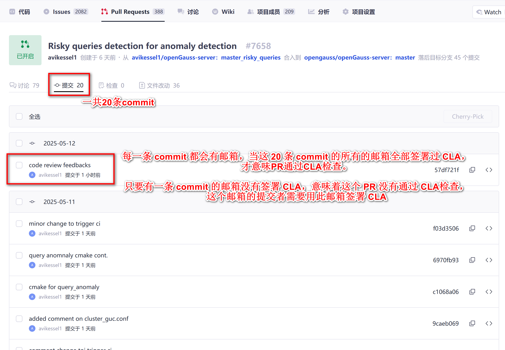
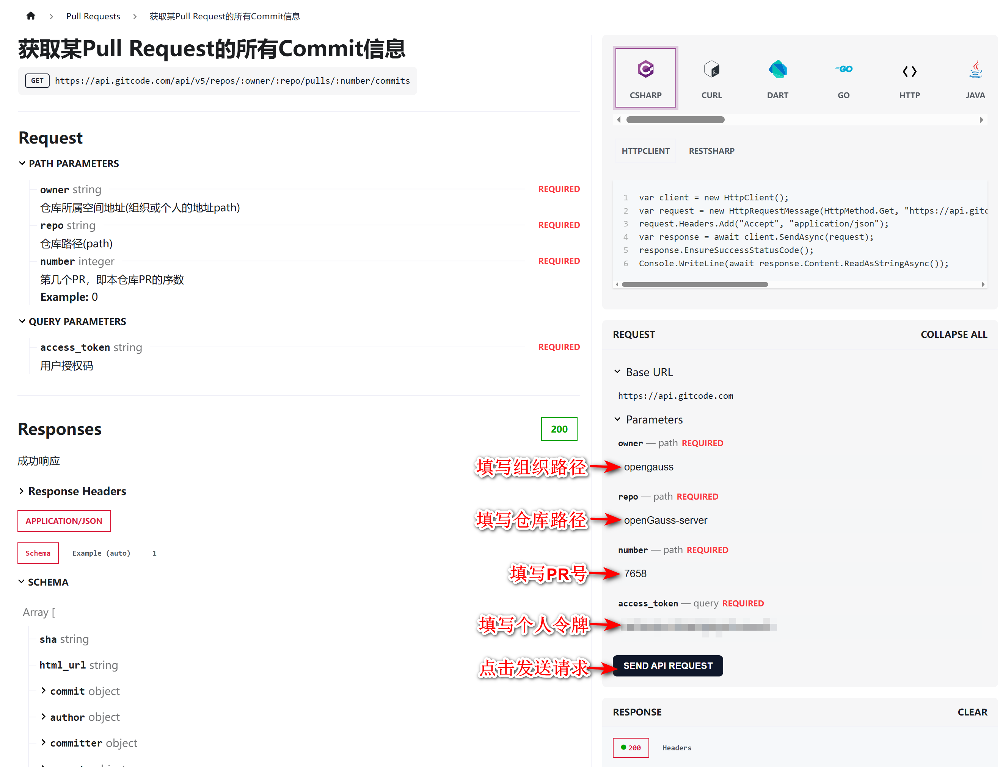
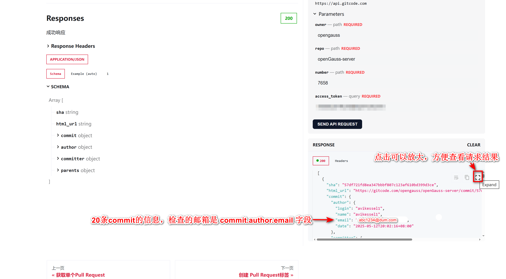
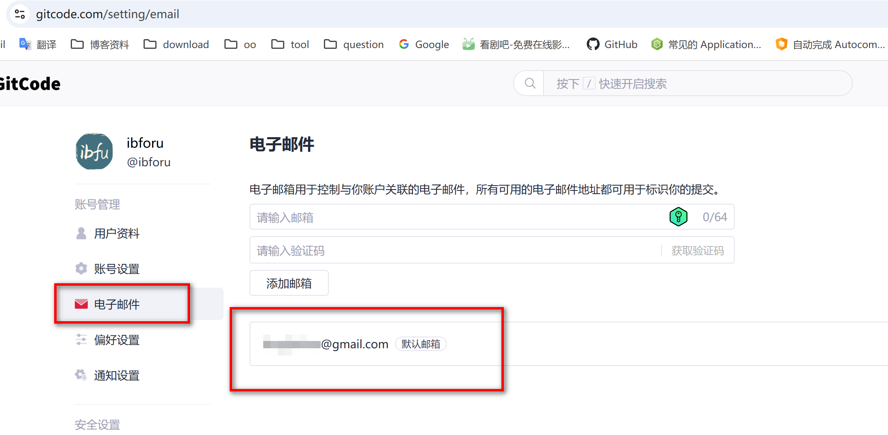
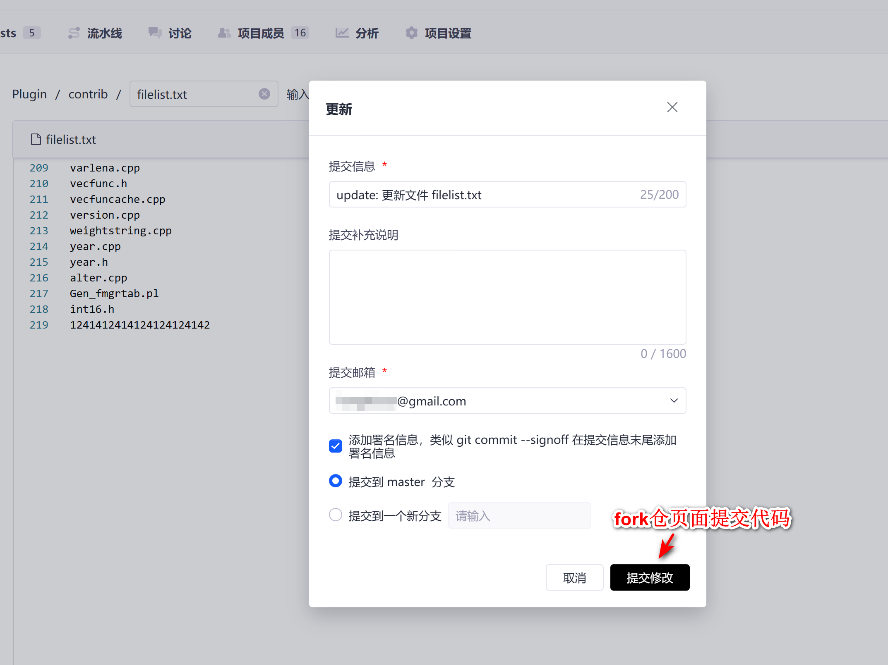
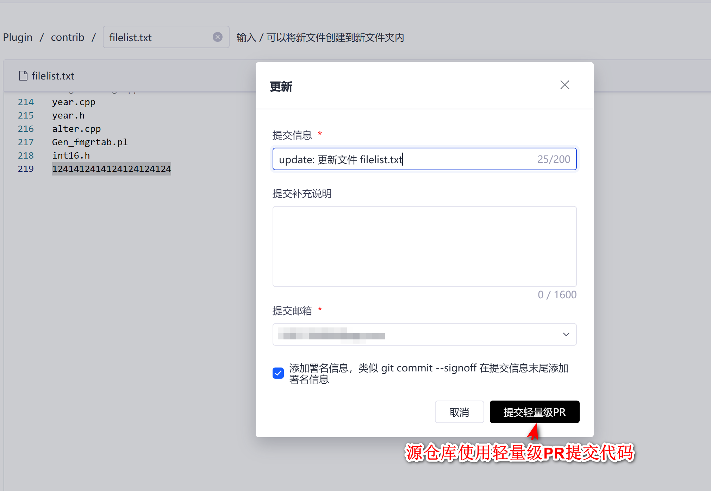

## 机器人是怎么检查PR是否签署了CLA的

- 机器人是通过检查PullRequest中**所有commit**作者的邮箱是否都签署了CLA来判定PR是否完成了CLA签署
- 如下图所示的一个PR
  

<hr style="border:1px solid gray"/>

## 怎么查看PR所有commit的作者的邮箱
- 可以通过 GitCode 平台的 OpenAPI 获取
  - OpenAPI: [获取某Pull Request的所有Commit信息](https://docs.gitcode.com/docs/apis/get-api-v-5-repos-owner-repo-pulls-number-commits)
- 使用方法如下：
  - 点击上方API链接打开页面，如下图输入请求参数，然后发送请求
    
  - 获取请求结果，如下所示
    

<hr style="border:1px solid gray"/>

## 当某个commit作者的邮箱未签署CLA怎么处理
1. 使用该邮箱签署CLA
2. 如果该邮箱签署的是员工CLA，请确保该邮箱已经被所属企业的CLA管理员激活
3. 如果该commit的邮箱设置错误，请参考[下一节](#amend_email)的方法处理

<hr style="border:1px solid gray"/>
## 怎么修改commit作者的邮箱

#### 第一步： 先确定绑定的邮箱
- 如果是通过 git 提交的PR，可以通过以下终端命令查看配置的邮箱
  - windows: `git config --global --list | findstr email`
  - linux: `git config --global --list | grep email`
- 如果是通过 GitCode 平台页面提交的PR，可以在 https://gitcode.com/setting/email 中查看配置的邮箱（需要登录）
  


#### 第二步： 重置 commit 提交
- 如果是通过 ***平台轻量级PR提交代码*** 或者 ***平台fork仓页面提交代码*** 的方式创建的PR，***<font color=red>需要关闭PR，再次提交代码后，重新创建PR</font>***。
  - fork仓页面提交代码
    
  - 平台轻量级PR提交代码
    

- 如果是通过 git 工具提交代码，然后创建的PR的话，***<font color=red>只需要使用 git 工具重新提交即可</font>***。<br>
  以下命令适用于PR的 ***N*** 条commit合成一条commit
  ```shell
  # step 1
  git reset --soft head~N    # n 是需要合并的commit的编号，最新提交的commit的编号是1，以此类推
  
  # step 2
  git add *            
  
  # step 3
  git status
  
  # step 4
  git commit -m "..."   # 重新提交，提交信息需要更新
  
  # step 5
  git push -f
  ```

#### 第三步： 进入 PR 页面，评论 **`/check-cla`** 触发 CLA 重新检查

#### 第四步： 确认 CLA 签署是否通过： CLA yes 标签是否打上
