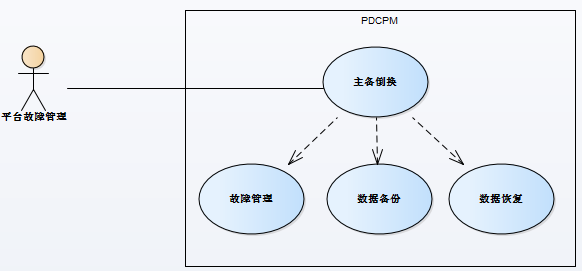

**openGauss xx特性设计说明书**

<table>
    <tr>
        <td>所属SIG组:</td>
        <td>xxx</td>
    </tr>
    <tr>
        <td>落入版本:</td>
        <td>xxx</td>
    </tr>
    <tr>
        <td>设计人员:</td>
        <td>xxx</td>
    </tr>
    <tr>
        <td>日期:</td>
        <td>xxx</td>
    </tr>
</table>

**Copyright © 2022 openGauss Community**

您对&quot;本文档&quot;的复制，使用，修改及分发受知识共享(Creative Commons)署名—相同方式共享4.0国际公共许可协议(以下简称&quot;CC BY-SA 4.0&quot;)的约束。
为了方便用户理解，您可以通过访问<https://creativecommons.org/licenses/by-sa/4.0/>了解CC BY-SA 4.0的概要 (但不是替代)。
CC BY-SA 4.0的完整协议内容您可以访问如下网址获取：<https://creativecommons.org/licenses/by-sa/4.0/legalcode>。

**改版记录**

<table>
    <tr>
        <th>日期</th>
        <th>修订版本</th>
        <th>修订描述</th>
        <th>作者</th>
        <th>审核</th>
    </tr>
    <tr>
        <td>xxx</td>
        <td>xxx</td>
        <td>xxx</td>
        <td>xxx</td>
        <td>xxx</td>
    </tr>
    <tr>
        <td>xxx</td>
        <td>xxx</td>
        <td>xxx</td>
        <td>xxx</td>
        <td>xxx</td>
    </tr>
</table>

# 1.特性概述

_简述本产品 __/__ 特性背景信息，简单概括本方案，对客户的价值、要达成的目的，并说明本文档包含的主要内容、适用范围等。_

## 1.1范围

_简述特性主要包含哪些功能点_

## 1.2特性需求列表

表X：特性需求列表

<table>
    <tr>
        <th>需求编号</th>
        <th>需求名称</th>
        <th>特性描述</th>
        <th>备注</th>
    </tr>
    <tr>
        <td>1</td>
        <td>xxx</td>
        <td>支持功能、提供业务能力</td>
        <td>xxx</td>  
    </tr>
    <tr>
        <td>2</td>
        <td>xxx</td>
        <td>支持功能、提供业务能力</td>
        <td>xxx</td>  
    </tr>
</table>

# 2.需求场景分析

## 2.1特性需求来源与价值概述

_描述该特性需求来源或背景，比如： __XXX__ 使用场景、 __XXX__ 内部优化等。描述该特性对用户带来什么具体价值，如果没有该特性，对用户使用或者竞争力带来什么损失。_

## 2.2特性场景分析

_描述该特性的业务使用场景_

_内容包括：_

1）场景触发条件及对象：什么角色/工具/接口等在什么具体情况下使用该特性，使用对象技能如何？

2）描述该特性主要有哪些用户应用场景、子场景及关键任务操作。_

## 2.3特性影响分析

_描述该特性在整个系统中的位置及周边接口。描述该特性有哪些关键约束或特性冲突。_

_与其他需求及特性的交互分析：_

_平台差异性分析：包括硬件平台和操作系统_

_兼容性分析：_

_约束及限制：_

### 2.3.1硬件限制

_简单描述承载子系统的硬件约束，主频，内存，线程数及其它对软件有影响的硬件特点_

_如有，给出规避方案。_

### 2.3.2技术限制

_操作系统：_

_编程语言：_

_如有，给出规避方案。_

### 2.3.3对License的影响分析

_明确对特性所涉及技术的合规性、所引入的第三方开源软件的 __license__ 的影响分析。_

### 2.3.4对系统性能规格的影响分析

_明确系统容量规格，基于特性运行资源的设定条件。比如至少需多少 __G__ 内存才能使用此特性_

### 2.3.5对系统可靠性规格的影响分析

_特性对于可靠性指标的影响，例如对RTO时间的影响等。_

### 2.3.6对系统兼容性的影响分析

_是否会影响数据库的前向兼容，也就是用户在数据库旧版本使用的特性在新版本上是否依然可以使用。_

### 2.3.7与其他重大特性的交互性，冲突性的影响分析

_分析包括周边工具、其他内核特性的交互和影响_

## 2.4同类社区/商用软件实现方案分析

_该特性在同类社区 __/__ 商用软件上的实现机制，对比分析，体现优劣性对比_

# 3.特性/功能实现原理(可分解出来多个Use Case)

## 3.1目标

_该章节主要描述特性在什么场景下要实现什么规格、达到什么目标_

## 3.2总体方案

_该章节主要阐述该特性的详细设计，包括选择什么硬件、使用什么算法、架构如何布局等_

_从整体流程上，根据场景分析和系统分解，将特性实现分为多个关键场景（ __Use Case__ ）_

_定义对接的原则_

_方案整体架构图_

_例如：_

图X：方案总体实现原理图

# 4.Use Case一实现

## 4.1设计思路

_说明 __Use Case__ 实现的思路_

## 4.2约束条件

_描述前提条件，即该功能开启的限制条件，比如会导致系统 __xx__ 功能不可用，比如在 __xx__ 内存限制下才能开启等。_

## 4.3详细实现(从用户入口的模块级别或进程级别消息序列图)

_本章节具体描述 __Use Case__ 实现过程。使用时序图、流程图描述各模块间的交互过程。_

_同时用简短文字说明时序图、流程图的各个模块分配需求的变化，尽量使用结构化的语言。_

## 4.4子系统间接口(主要覆盖模块接口定义)

_在这个章节只要说本次修改涉及哪个 __.h__ 的哪个接口的修改，大致的修改内容简述下即可。_

## 4.5子系统详细设计

_详细描述各模块的修改点。_

## 4.6DFX属性设计

### 4.6.1性能设计

_特性是否影响已有的相关性能指标，是否会影响现有特性的性能，如何保证新特性的性能_

### 4.6.2升级与扩容设计

_特性是否会影响到升级和扩容_

_升级设计原则包括: _

1. _涉及系统表修改的特性，必须设计系统表升级脚本和回滚脚本，以及版本号控制     
2. _对于涉及修改持久化数据（如日志）的特性，必须考虑新老版本共存时的兼容性场景，必要情况下，需要增加版本号以进行控制
3. _对于涉及修改执行态数据格式（如syscache结构）的特性，必须考虑新老版本共存时的兼容性场景，必要情况下，需要增加版本号以进行控制
4. _涉及升级工具gs_upgradectl的修改，设计需要考虑灰度升级、回滚、再升级和升级提交等内部逻辑      
5. _涉及集群管理工具(例如om或cm)的公共函数修改，设计需要考虑灰度升级、回滚、再升级和升级提交等内部逻辑

### 4.6.3异常处理设计

_有哪些异常场景，是否有规避方案，怎么提示用户，如何保证用户业务影响最小。包括冗余设计、故障管理、过载控制设计、人因差错设计、故障预测预防设计等_

### 4.6.4资源管理相关设计

_是否占用额外的内存、磁盘 __I/O__ 、网络 __I/O__ 等资源，资源占用规格是什么，如果资源超出环境限制后，是否有处置措施_

### 4.6.5小型化设计

_请说明特性是否会影响小型化版本的规格（内存使用、安装包大小、 __CPU__ 占用等），如果影响，是否有调整优化手段或者使用宏隔离。_

### 4.6.6可测性设计

_特性是否具备可测试性，给出测试应该涵盖的功能、性能、安全、可靠性等方面，涵盖边界值、异常场景等。_

### 4.6.7 安全设计

#### 4.6.7.1 安全设计确认

*参考安全设计checklist进行确认*

| 安全属性     | 检查项                                                       | 检查项详细说明                                               | 是否涉及 | 是否满足 |
| ------------ | ------------------------------------------------------------ | ------------------------------------------------------------ | -------- | -------- |
| 访问通道控制 | 是否新增侦听端口                                             | 新增侦听端口需刷新通信矩阵                                   |          |          |
| 访问通道控制 | 是否新增进程或组件间通信                                     | 新增进程或组件间通信刷新通信矩阵                             |          |          |
| 访问通道控制 | 是否新增认证方式                                             | 新增认证方式需刷新通信矩阵及产品文档                         |          |          |
| 权限控制     | 是否涉及创建文件或目录                                       | 创建文件或目录须显式指定文件或目录的访问权限                 |          |          |
| 权限控制     | 账号权限是否满足"权限最小化原则"                             | 系统中各账号应赋予最小权限                                   |          |          |
| 权限控制     | 是否存在用户权限提升                                         | 禁止出现用户非法权限提升                                     |          |          |
| 未公开接口   | 是否新增GUC参数                                              | 新增GUC参数需刷新产品文档                                    |          |          |
| 未公开接口   | 是否新增或修改函数、视图、系统表                             | 新增或修改函数、视图、系统表需刷新产品文档，考虑权限控制     |          |          |
| 未公开接口   | 是否新增SQL语法                                              | 新增SQL语法需刷新产品文档，支持记录审计日志                  |          |          |
| 未公开接口   | 是否新增内部工具                                             | 新增内部工具需刷新产品文档                                   |          |          |
| 未公开接口   | 脚本中是否存在注释代码                                       | Shell/Python等解释性语言禁止注释代码，注释代码需要删除       |          |          |
| 未公开接口   | 是否存在隐藏命令、参数、端口等接入方式                       | 对于现网维护期间不会使用的命令/参数、端口等接入方式（包括但不限于产品的生产、调测、维护用途），必须删除（如通过编译宏） |          |          |
| 未公开接口   | 系统是否存在隐藏后门                                         | 禁止系统预留任何的未公开账号，所有账号必须可被系统管理，并在资料中予以说明 |          |          |
| 未公开接口   | 禁止在产品对外部用户发布的软件（包含软件包/补丁包）中提供破解类、网络嗅探类工具。 | 1、禁止在产品对外部用户发布的软件（包含软件包/补丁包）中提供可修改任意用户口令、具有“口令破解能力”（指口令暴力破解、利用系统/算法漏洞恶意破解口令）、对包含敏感数据的文件（如包含密钥的配置文件、数据库）进行解密的功能或工具。2、禁止在系统中保留第三方的网络嗅探工具tcpdump、gdb、strace、readelf网络、进程调试工具，cpp、gcc、dexdump、mirror、JDK开发/编译工具和仅在调测阶段使用的自研调试工具/脚本（例如：仅在调试阶段使用的加解密脚本、调测功能、可以提权的命令），由于业务需要必须保留的，需要进行严格的访问控制。同时在资料中说明保留的原因、使用的场景、风险。 |          |          |
| 敏感数据保护 | 认证凭据不允许明文存储在系统中，应该加密保护。               | 认证凭据（如口令/私钥等）不允许明文存储在系统中，应该加密保护。 |          |          |
| 敏感数据保护 | 用于敏感数据传输加密的密钥，不能硬编码在代码中。             | 禁止口令和密钥硬编码。                                       |          |          |
| 敏感数据保护 | 是否明文打印口令或密钥等敏感信息                             | 禁止在系统中存储的日志、调试信息、错误提示及ps命令等信息打印明文敏感信息（口令/私钥/预共享密钥）。 |          |          |
| 敏感数据保护 | 是否明文回显口令                                             | 禁止明文回显口令。                                           |          |          |
| 敏感数据保护 | 是否使用第三方和开源软件的缺省口令                           | 禁止使用第三方和开源软件的缺省口令，参考安全设计指南第1.5章节。 |          |          |
| 敏感数据保护 | 是否将密码明文存储在配置文件中                               | 明文密码不允许写入配置文件（命令行工具安装部署及使用时必需配置密码的场景除外）。 |          |          |
| 敏感数据保护 | 是否使用不安全的加密算法                                     | 禁止使用私有的或业界已知不安全的加密算法。推荐加密算法安全设计指南6.2章节。 |          |          |
| 敏感数据保护 | 口令等敏感信息是否使用安全的传输通道                         | 在非信任网络之间进行敏感信息传输须采用安全传输通道或者加密后传输。参考安全设计指南第10章。 |          |          |
| 敏感数据保护 | 内存中口令或密钥等敏感信息使用后是否销毁                     | 内存中的口令或密钥等信息使用完毕后立即清0。                  |          |          |
| 敏感数据保护 | 密码算法中使用到的随机数必须是密码学意义上的安全随机数。     | 密码算法中使用到的随机数必须是密码学意义上的安全随机数，参考安全设计指南6.3章节。 |          |          |
| 敏感数据保护 | 资料中是否存在不安全的示例                                   | 资料中的示例需要是安全的，对用户进行正确的引导，若示例中存在潜在的风险，要在资料中进行说明。 |          |          |
| 认证         | 是否提供认证机制                                             | 新系统需要提供认证机制并缺省开启。                           |          |          |
| 认证         | 认证是否在服务端进行                                         | 认证处理过程需要在服务端进行。                               |          |          |
| 认证         | 认证失败后服务端是否返回有效信息                             | 认证失败后，服务端返回信息不能提供详细的、可用于判断具体错误原因的提示。 |          |          |
| 外部参数校验 | 是否对外部输入进行合法性校验                                 | 1、使用外部输入数据作为循环终止条件、数组下标、内存分配大小参数等，可能导致系统出现死循环、缓冲区溢出、内存越界、拒绝服务等一系列行为。2、文件路径等外部输入应进行合法性校验，防止注入风险 |          |          |
| 三方件引入   | 是否新引入三方组件                                           | 1.新增三方组件需要通过安全编译选项、病毒、漏洞、开源片段引用、license合规、开源组件扫描，参考版本发布网络安全质量要求。2.新增三方组件需保证来源可信。 |          |          |

#### 4.6.7.3 设计实现

*说明整体安全设计方案，以及详细实现、接口定义等*

## 4.7系统外部接口

_是否会影响到系统外部接口，包括 __guc__ 参数、工具使用方式、 __SQL__ 语法、网络协议、系统表视图函数、驱动（ __JDBC/ODBC__ ）等_

## 4.8自测用例设计

_描述自测用例是如何设计的，如何测试保证功能符合预期_

# 5.Use Case二实现

_同第 __4__ 章_

# 6.特性非功能性质量属性相关设计

## 6.1可测试性

_重点从特性在测试的方向和规格上展开描述，说明在测试人员测试时应该测哪些方面，需要注意哪些边界值、异常值、异常场景。_

## 6.2语法兼容性

_重点描述特性支持A/B/C/D/PG等兼容模式中的哪一些，在不同模式下的表现是否一致_

## 6.3可维护性

_重点从特性的可维护性展开描述，比如诊断视图、 __log__ 打印等。_

## 6.4资料

_参考下表，评估特性会涉及到的各类资料的修改点，并说明具体修改点。_

<table>
    <tr>
        <th>类别</th>
        <th>手册名称</th>
        <th>是否涉及（Y/N)</th>
        <th>具体修改或新增内容简述</th>
    </tr>
    <tr>
        <td>白皮书</td>
        <td>技术白皮书</td>
        <td>N</td>
        <td>XX章节新增XX技术</td>
    </tr>
    <tr>
        <td rowspan="8">产品文档</td>
        <td>产品描述</td>
        <td>Y</td>
        <td>技术指标刷新为XX</td>
    </tr>
    <tr>
        <td>特性描述</td>
        <td>Y</td>
        <td>新增XX特性</td>
    </tr>
    <tr>
        <td>编译指导书</td>
        <td>Y</td>
        <td>XXX</td>
    </tr>
    <tr>
        <td>安装指南</td>
        <td>Y</td>
        <td>安装集群章节需刷新XX场景</td>
    </tr>
    <tr>
        <td>管理员指南</td>
        <td>N</td>
        <td>XXX</td>
    </tr>
    <tr>
        <td>开发者指南 （包括开发教程、SQL参考、系统表和系统视图、GUC参数说明、错误码说明、API参考等）</td>
        <td>Y</td>
        <td>在XX章节增加XXX功能</td>
    </tr>
    <tr>
        <td>工具参考</td>
        <td>Y</td>
        <td>新增XX工具</td>
    </tr>
    <tr>
        <td>术语表</td>
        <td>Y</td>
        <td>新增术语XX</td>
    </tr>
    <tr>
        <td>入门</td>
        <td>简易教程</td>
        <td>N</td>
        <td>XXX</td>
    </tr>
</table>

# 7.数据结构设计（可选）

_本章节完成数据库结构的设计（数据库系统表结构，可以使用 __Power Designer__ 完成），可选章节。_

# 8.参考资料清单
