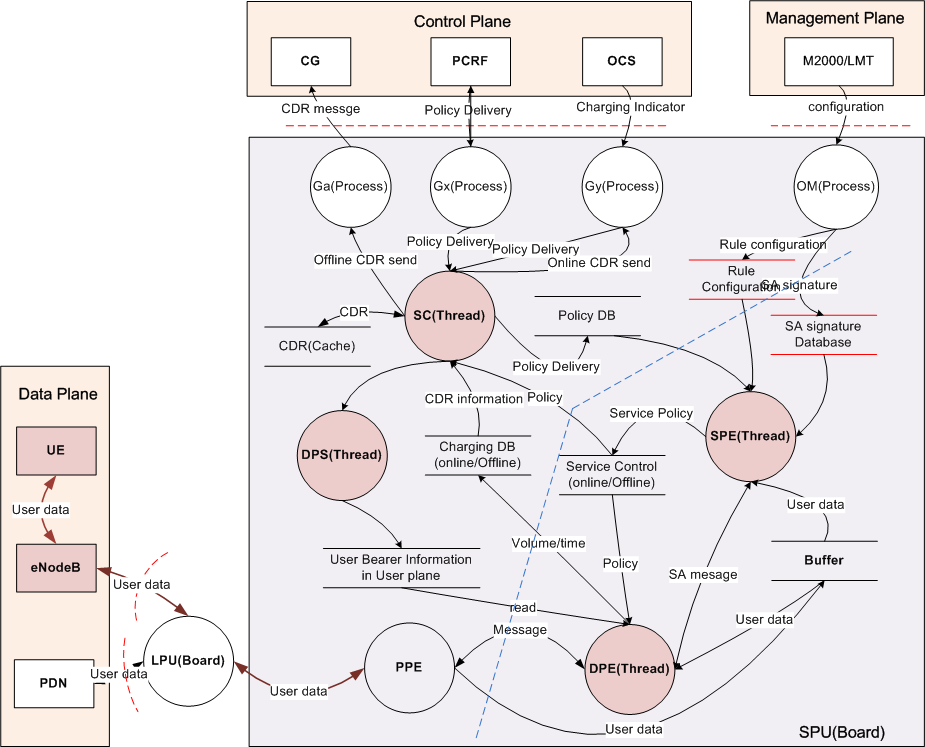

**openGauss xx特性设计说明书**

<table>
    <tr>
        <td>所属SIG组:</td>
        <td>xxx</td>
    </tr>
    <tr>
        <td>落入版本:</td>
        <td>xxx</td>
    </tr>
    <tr>
        <td>设计人员:</td>
        <td>xxx</td>
    </tr>
    <tr>
        <td>日期:</td>
        <td>xxx</td>
    </tr>
</table>

**Copyright © 2022 openGauss Community**

您对&quot;本文档&quot;的复制，使用，修改及分发受知识共享(Creative Commons)署名—相同方式共享4.0国际公共许可协议(以下简称&quot;CC BY-SA 4.0&quot;)的约束。
为了方便用户理解，您可以通过访问<https://creativecommons.org/licenses/by-sa/4.0/>了解CC BY-SA 4.0的概要 (但不是替代)。
CC BY-SA 4.0的完整协议内容您可以访问如下网址获取：<https://creativecommons.org/licenses/by-sa/4.0/legalcode>。

**改版记录**

<table>
    <tr>
        <th>日期</th>
        <th>修订版本</th>
        <th>修订描述</th>
        <th>作者</th>
        <th>审核</th>
    </tr>
    <tr>
        <td>xxx</td>
        <td>xxx</td>
        <td>xxx</td>
        <td>xxx</td>
        <td>xxx</td>
    </tr>
    <tr>
        <td>xxx</td>
        <td>xxx</td>
        <td>xxx</td>
        <td>xxx</td>
        <td>xxx</td>
    </tr>
</table>

**目录**

1.特性概述

1.1范围

1.2特性需求列表

2.需求场景分析

2.1特性需求来源与价值概述

2.2特性场景分析

2.3特性影响分析

2.3.1硬件限制

2.3.2技术限制

2.3.3对License的影响分析

2.3.4对系统性能规格的影响分析

2.3.5对系统可靠性规格的影响分析

2.3.6对系统兼容性的影响分析

2.3.7与其他重大特性的交互性，冲突性的影响分析

2.4同类社区/商用软件实现方案分析

3.特性/功能实现原理(可分解出来多个Use Case)

3.1目标

3.2总体方案

4.Use Case一实现

4.1设计思路

4.2约束条件

4.3详细实现(从用户入口的模块级别或进程级别消息序列图)

4.4子系统间接口(主要覆盖模块接口定义)

4.5子系统详细设计

4.6DFX属性设计

4.6.1性能设计

4.6.2升级与扩容设计

4.6.3异常处理设计

4.6.4资源管理相关设计

4.6.5小型化设计

4.6.6可测性设计

4.6.7安全设计

4.7系统外部接口

4.8自测用例设计

5.Use Case二实现

6.可靠性&amp;可用性设计

6.1冗余设计

6.2故障管理

6.3过载控制设计

6.4升级不中断业务

6.5人因差错设计

6.6故障预测预防设计

7.安全&amp;隐私&amp;韧性设计

7.1Low Level威胁分析及设计

7.1.12层数据流图

7.1.2业务场景及信任边界说明

7.1.3外部交互方分析

7.1.4数据流分析

7.1.5处理过程分析

7.1.6数据存储分析

7.1.7缺陷列表

7.2隐私风险分析与设计

7.2.1隐私风险预分析问卷

7.2.2隐私风险预分析总结

7.2.3个人数据列表

7.2.4XX需求设计

7.2.5YY需求设计

8.特性非功能性质量属性相关设计

8.1可测试性

8.2可服务性

8.3可演进性

8.4开放性

8.5兼容性

8.6可伸缩性/可扩展性

8.7 可维护性

8.8 资料

9.数据结构设计（可选）

10.参考资料清单

**表目录**

表X：特性场景相关性分析

表X：特性需求列表

**图目录**

图X：方案总体实现原理图

图X：样图：处理流程示意图

**List of abbreviations**  **缩略语清单** ：

<table>
    <tr>
        <th>Abbreviations 缩略语</th>
        <th>Full spelling 英文全名</th>
        <th>Chinese explanation 中文解释</th>
    </tr>
    <tr>
        <td>xxx</td>
        <td>xxx</td>
        <td>xxx</td>
    </tr>
    <tr>
        <td>xxx</td>
        <td>xxx</td>
        <td>xxx</td>
    </tr>
</table>

# 1.特性概述

_简述本产品 __/__ 特性背景信息，简单概括本方案，对客户的价值、要达成的目的，并说明本文档包含的主要内容、适用范围等。_

## 1.1范围

_简述特性主要包含哪些功能点_

## 1.2特性需求列表

表X：特性需求列表

<table>
    <tr>
        <th>需求编号</th>
        <th>需求名称</th>
        <th>特性描述</th>
        <th>备注</th>
    </tr>
    <tr>
        <td>1</td>
        <td>xxx</td>
        <td>支持功能、提供业务能力</td>
        <td>xxx</td>  
    </tr>
    <tr>
        <td>2</td>
        <td>xxx</td>
        <td>支持功能、提供业务能力</td>
        <td>xxx</td>  
    </tr>
</table>

# 2.需求场景分析

## 2.1特性需求来源与价值概述

_描述该特性需求来源或背景，比如： __XXX__ 使用场景、 __XXX__ 内部优化等。描述该特性对用户带来什么具体价值，如果没有该特性，对用户使用或者竞争力带来什么损失。_

## 2.2特性场景分析

_描述该特性的业务使用场景_

_内容包括：_

1）场景触发条件及对象：什么角色/工具/接口等在什么具体情况下使用该特性，使用对象技能如何？

2）描述该特性主要有哪些用户应用场景、子场景及关键任务操作。_

## 2.3特性影响分析

_描述该特性在整个系统中的位置及周边接口。描述该特性有哪些关键约束或特性冲突。_

_与其他需求及特性的交互分析：_

_平台差异性分析：包括硬件平台和操作系统_

_兼容性分析：_

_约束及限制：_

### 2.3.1硬件限制

_简单描述承载子系统的硬件约束，主频，内存，线程数及其它对软件有影响的硬件特点_

_如有，给出规避方案。_

### 2.3.2技术限制

_操作系统：_

_编程语言：_

_如有，给出规避方案。_

### 2.3.3对License的影响分析

_明确对特性所涉及技术的合规性、所引入的第三方开源软件的 __license__ 的影响分析。_

### 2.3.4对系统性能规格的影响分析

_明确系统容量规格，基于特性运行资源的设定条件。比如至少需多少 __G__ 内存才能使用此特性_

### 2.3.5对系统可靠性规格的影响分析

_特性对于可靠性指标的假设和约束，例如在预设的条件下要支持 __x__ 个 __9__ 的目标等。_

### 2.3.6对系统兼容性的影响分析

_是否会影响数据库的前向兼容，也就是用户在数据库旧版本使用的特性在新版本上是否依然可以使用。_

### 2.3.7与其他重大特性的交互性，冲突性的影响分析

_分析包括周边工具、其他内核特性的交互和影响_

## 2.4同类社区/商用软件实现方案分析

_该特性在同类社区 __/__ 商用软件上的实现机制，对比分析，体现优劣性对比_

# 3.特性/功能实现原理(可分解出来多个Use Case)

## 3.1目标

_该章节主要描述特性在什么场景下要实现什么规格、达到什么目标_

## 3.2总体方案

_该章节主要阐述该特性的详细设计，包括选择什么硬件、使用什么算法、架构如何布局等_

_从整体流程上，根据场景分析和系统分解，将特性实现分为多个关键场景（ __Use Case__ ）_

_定义对接的原则_

_方案整体架构图_

_例如：_

图X：方案总体实现原理图

# 4.Use Case一实现

## 4.1设计思路

_说明 __Use Case__ 实现的思路_

## 4.2约束条件

_描述前提条件，即该功能开启的限制条件，比如会导致系统 __xx__ 功能不可用，比如在 __xx__ 内存限制下才能开启等。_

## 4.3详细实现(从用户入口的模块级别或进程级别消息序列图)

_本章节具体描述 __Use Case__ 实现过程。使用时序图、流程图描述各模块间的交互过程。_

_同时用简短文字说明时序图、流程图的各个模块分配需求的变化，尽量使用结构化的语言。_

## 4.4子系统间接口(主要覆盖模块接口定义)

_在这个章节只要说本次修改涉及哪个 __.h__ 的哪个接口的修改，大致的修改内容简述下即可。_

## 4.5子系统详细设计

_详细描述各模块的修改点。_

## 4.6DFX属性设计

### 4.6.1性能设计

_特性是否影响已有的相关性能指标，是否会影响现有特性的性能，如何保证新特性的性能_

### 4.6.2升级与扩容设计

_特性是否会影响到升级和扩容_

_升级设计原则包括: _

1. _涉及系统表修改的特性，必须设计系统表升级脚本和回滚脚本，以及版本号控制     
2. _对于涉及修改持久化数据（如日志）的特性，必须考虑新老版本共存时的兼容性场景，必要情况下，需要增加版本号以进行控制
3. _对于涉及修改执行态数据格式（如syscache结构）的特性，必须考虑新老版本共存时的兼容性场景，必要情况下，需要增加版本号以进行控制
4. _涉及升级工具gs_upgradectl的修改，设计需要考虑灰度升级、回滚、再升级和升级提交等内部逻辑      
5. _涉及集群管理工具(例如om或cm)的公共函数修改，设计需要考虑灰度升级、回滚、再升级和升级提交等内部逻辑

### 4.6.3异常处理设计

_有哪些异常场景，是否有规避方案，怎么提示用户，如何保证用户业务影响最小_

### 4.6.4资源管理相关设计

_是否占用额外的内存、磁盘 __I/O__ 、网络 __I/O__ 等资源，资源占用规格是什么，如果资源超出环境限制后，是否有处置措施_

### 4.6.5小型化设计

_请说明特性是否会影响小型化版本的规格（内存使用、安装包大小、 __CPU__ 占用等），如果影响，是否有调整优化手段或者使用宏隔离。_

### 4.6.6可测性设计

_特性是否具备可测试性，给出测试应该涵盖的功能、性能、安全、可靠性等方面，涵盖边界值、异常场景等。_

### 4.6.7安全设计

_有哪些会影响数据库或者 __OS__ 安全的地方，比如用户权限管理、秘钥管理、网络协议、外部攻击等。_

## 4.7系统外部接口

_是否会影响到系统外部接口，包括 __guc__ 参数、工具使用方式、 __SQL__ 语法、网络协议、系统表视图函数、驱动（ __JDBC/ODBC__ ）等_

## 4.8自测用例设计

_描述自测用例是如何设计的，如何测试保证功能符合预期_

# 5.Use Case二实现

_同第 __4__ 章_

# 6.可靠性&amp;可用性设计

## 6.1冗余设计

_特性设计考虑的冗余主要是系统采用了冗余设计，特性需要考虑镜像备份、配置参数备份和主备冗余系统之间进行数据同步等信息。_

_特性设计时，需要给出备份的关键配置参数清单，主备冗余系统之间进行数据同步时间 __/__ 策略和关键数据清单，主备切换时数据核查机制 __/__ 脏数据处理策略、备份恢复策略等。_

_对于镜像式备份，如快照 __/checkpoint__ 机制，需要给出备份周期、数据核查机制 __/__ 脏数据处理策略、恢复策略等，对系统性能有明显影响的特性，需要给出设计约束条件。_

## 6.2故障管理

_故障管理包括故障检测、故障隔离、故障定位、故障恢复和相互关联的设计。_

_特性的故障管理，主要是特性自身的故障检测、告警 __/__ 日志设计、故障恢复以及故障接口设计。_

_故障管理通常的设计原则包括：_

1. _故障全面快速检测通常考虑检测范围、备用检测、检测速度、检测影响；_
2. _控制失效影响范围通常考虑多平面、多粒度、隔离单位等隔离域划分；_
3. _故障快速恢复通常考虑自动恢复、优先恢复、分级复位、无耦合恢复、分层保护等策略。_

_故障管理常见的设计模式包括 __RollBack__ 模式、故障 __Bypass__ 、断路器模式、隔离仓模式等。_

## 6.3过载控制设计

_特性的过载控制设计需要考虑特性内处理业务的流量检测、检测位置和业务丢弃位置、业务丢弃时响应的业务消息信息，以及与统一的过载控制机制之间的调用、被调用关系、接口。_

_特性内部简单的过载控制机制通常采用限速的方式，需要考虑限速的位置、默认限速值、日志告警等信息。_

_过载控制通常的设计原则包括动态限流、弹性扩缩容、先负载均衡后流控、尽早控制、优先级保障、优雅降级设计等：_

1. _尽早控制：系统过载时，应尽可能在业务流程处理前端或业务处理较早的处理模块上控制业务接入，避免中间控制带来不必要的性能消耗；_
2. _优先级保障：系统过载时保证高优先级的业务能够优先获得资源，优先得到处理，从而保证社会效益最大化；_
3. _优雅降级设计：非核心业务降级、核心功能放通、体验降级等。_

## 6.4升级不中断业务

_特性内部的升级不中断业务，主要考虑特性在不同软件版本的消息兼容、配置数据格式兼容、接口兼容、与周边特性的相互依赖，以及升级失败时的快速回退处理过程。_

## 6.5人因差错设计

_特性的人因差错主要考虑特性涉及的命令、操作、配置文件 __/__ 数据等人机接口的错误防护，通常考虑如下几个方面：_

1. _删除、破坏性修改需要提供高危提示以及二次确认，页面焦点默认&quot;取消&quot;。用户可见接口（ __cli__ 以及 __web__ 页面）都需要考虑，包括开源组件提供的命令接口；_
2. _对重启节点操作需要提前检查是否影响客户 __VM__ 运行，给出明确提示建议操作；_
3. _所有高危操作需要记录审计日志；_
4. _预防配置错误、预防硬件误操作、操作执行前的系统检查和操作错误后的快速回退。_

_人因差错通常的设计原则包括：_

1. _角色约束：通过权限控制设计预防对不同角色的配置范围进行约束，避免越权配置导致错误；_
2. _配置校验：通过配置生效机制设计确保在配置生效前进行必要的校验，避免错误配置生效；_
3. _备份恢复：通过配置数据备份与恢复设计确保在出现配置错误时能够快速恢复到正确的配置数据状态。_

## 6.6故障预测预防设计

_特性应配合系统故障预测预防能力提供相关的数据采集和统计接口。比如磁盘空间检测等。_

# 7.安全&amp;隐私&amp;韧性设计

_不涉及的需要说明原因或者简要说明存在的风险(通常低风险且无对应消减建议的可不写当前章节)_

## 7.1Low Level威胁分析及设计

### 7.1.12层数据流图

_Low level数据流图（2层数据流图）主要绘制具体的业务特性中数据的交互过程，该层数据流图需要能够描述清楚整个业务的交互过程，若涉及开源软件，需将开源软件作为产品的一部分进行整体的Low Level威胁分析。_

_2层数据流图的例子：_

_数据流图元素及说明如下表所示：_

<table>
    <tr>
        <th>元素</th>
        <th>符号</th>
        <th>描述</th>
    </tr>
    <tr>
        <td>外部交互方</td>
        <td></td>
        <td>能驱动系统业务，但不受系统控制的人和物(如用户，管理员，第三方系统等).通常表示目标系统的输入/输出。涉及到个人数据需在元素概述中详细列举元素涉及的高、中、低影响的个人数据。</td>  
    </tr>
    <tr>
        <td>处理过程</td>
        <td></td>
        <td>一个过程执行一个任务时的逻辑表示，例如 Web Server 、 ftp server 、LMT server</td> 
    </tr>
    <tr>
        <td>数据存储</td>
        <td></td>
        <td>数据存储表示文件、数据库、注册表项、内存等 。涉及到个人数据需在元素概述中详细列举元素涉及的高、中、低影响的个人数据。</td> 
    </tr>
    <tr>
        <td>数据流</td>
        <td></td>
        <td>数据在系统中的移动方向，如网络通讯、共享内存、函数调用等。涉及到个人数据需在元素概述中详细列举元素涉及的高、中、低影响的个人数据。</td> 
    </tr>
    <tr>
        <td>信任边界</td>
        <td></td>
        <td>当数据流穿越不同的信任级别(区域)时，就存在信任边界，例如从用户态到内核态，从客户端到服务端等。</td> 
    </tr>
</table>

### 7.1.2业务场景及信任边界说明

_针对数据流图，描述业务场景，描述数据流图中主要元素在业务场景中的作用；_

_对信任边界进行说明_

### 7.1.3外部交互方分析

_针对数据流图中外部交互方进行威胁分析，外部交互方需要分析仿冒和抵赖两种威胁_

<table>
    <tr>
        <td>元素名称</td>
        <td colspan="3">xxx</td>
    </tr>
    <tr>
        <td>元素概述</td>
        <td colspan="3">对分析的元素进行描述，如涉及收集或处理个人数据，需详细列出系统中被收集或处理的高、中、低影响的个人数据
             
            高影响个人数据：
             
            中影响个人数据：
             
            低影响个人数据：
        </td>
    </tr>
    <tr>
        <td rowspan="7">仿冒（S）</td>
        <td>风险级别</td>
        <td colspan="2">
            高/中/低
        </td>
    </tr>
    <tr>
        <td>影响等级</td>
        <td colspan="2">
            影响等级: (高/中/低)
             
            影响描述: 如下:
             
            如果系统被攻击，业务将会受到什么影响？例如：
             
            1、如果数据库管理员被仿冒，攻击者可以给数据库下发任意配置命令，影响业务的正常运行。
        </td>
    </tr>
    <tr>
        <td>已有消减措施</td>
        <td colspan="2">
            针对该威胁，系统已经采取了哪些防范措施？请在此处详细描述。例如：
             
            1、在使用帐号密码方式登录到数据库时，需要通过认证。认证方式需要管理员配置。
             
            2、系统中存在默认帐户和密码。如果默认密码没有修改，系统会不断产生告警，提示用户修改.
        </td>
    </tr>
    <tr>
        <td>可能性(Exploitability)</td>
        <td colspan="2">
            威胁的可能性描述也就是设计缺陷如何被利用的描述，这里有两种描述方式：
             
            第一种：对于高风险缺陷必须描述攻击路径；
             
            第二种：对于中低风险缺陷可通过文字描述；
             
            攻击路径可选，下面是这两种方式的样例
             
            缺陷 1：
             
            攻击路径：（可选，对于高风险威胁，必须写攻击路径；对于中低风险可选）
             
            结合已有消减措施中的缺陷和不足，探讨可能的攻击路径，并通过画图的的方式将攻击路径描述出来，在每个攻击路径的叶子节点是该攻击利用的设计缺陷，并对该条缺陷进行定级
             
            对于消减措施已经是最佳实践，当前设计无缺陷，描述如下：
             
            当前设计无缺陷，风险低
        </td>
    </tr>
    <tr>
        <td rowspan="3">建议消减措施 (Recommendations)</td>
        <td>措施</td>
        <td>落地计划</td>
    </tr>
    <tr>
        <td>针对已有消减措施中的缺陷和不足，适当增加一些防范措施。例如：当首次登录时，强制用户修改默认密码。</td>
        <td>根据威胁的风险等级、工作量、版本策略等因素制定落地计划。例如：当前openGauss 3.0.0版本落地。</td>
    </tr>
    <tr>
        <td>xxx</td>
        <td>xxx</td>
    </tr>
    <tr>
        <td rowspan="7">抵赖（R）</td>
        <td>风险级别</td>
        <td colspan="2">
            高/中/低
        </td>
    </tr>
    <tr>
        <td>影响等级</td>
        <td colspan="2">
            xxx
        </td>
    </tr>
    <tr>
        <td>已有消减措施</td>
        <td colspan="2">
            xxx
        </td>
    </tr>
    <tr>
        <td>可能性(Exploitability)</td>
        <td colspan="2">
            xxx
        </td>
    </tr>
    <tr>
        <td rowspan="3">建议消减措施 (Recommendations)</td>
        <td>措施</td>
        <td>落地计划</td>
    </tr>
    <tr>
        <td>xxx</td>
        <td>xxx</td>
    </tr>
    <tr>
        <td>xxx</td>
        <td>xxx</td>
    </tr>
    <tr>
        <td rowspan="7">隐私（P）</td>
        <td>风险级别</td>
        <td colspan="2">
            高/中/低
        </td>
    </tr>
    <tr>
        <td>影响等级</td>
        <td colspan="2">
            影响等级: (高/中/低)
             
            影响描述: 如下:
             
            如果系统中存在XX隐私问题，客户或个人将会受到什么影响？
        </td>
    </tr>
    <tr>
        <td>已有消减措施</td>
        <td colspan="2">
            针对该隐私问题，系统已经采取了哪些措施？请在此处详细描述。
        </td>
    </tr>
    <tr>
        <td>可能性(Exploitability)</td>
        <td colspan="2">
            对于高风险的隐私问题，我们需要写出发现隐私问题需要怎样的技术手段。
             
            如果消减措施已经是最佳实践，当前设计无缺陷，描述如下：
             
            当前设计无缺陷，风险低
        </td>
    </tr>
    <tr>
        <td rowspan="3">建议消减措施 (Recommendations)</td>
        <td>措施</td>
        <td>落地计划</td>
    </tr>
    <tr>
        <td>针对已有消减措施中的缺陷和不足，适当增加一些防范措施。</td>
        <td>根据威胁的风险等级、工作量、版本策略等因素制定落地计划。例如：当前openGauss 3.0.0版本落地。</td>
    </tr>
    <tr>
        <td>xxx</td>
        <td>xxx</td>
    </tr>
</table>

### 7.1.4数据流分析

_针对数据流图中的数据流元素进行威胁分析，外部交互方需要分析篡改、消息泄漏、拒绝服务三种威胁_

<table>
    <tr>
        <td>元素名称</td>
        <td colspan="3">xxx</td>
    </tr>
    <tr>
        <td>元素概述</td>
        <td colspan="3">对分析的元素进行描述，如涉及收集或处理个人数据，需详细列出系统中被收集或处理的高、中、低影响的个人数据
             
            高影响个人数据：
             
            中影响个人数据：
             
            低影响个人数据：
        </td>
    </tr>
    <tr>
        <td>威胁</td>
        <td colspan="3">
            TID（对于篡改、消息泄露的威胁，需分析到算法级别（关注使用的不安全协议版本/算法/参数））
        </td>
    </tr>
    <tr>
        <td rowspan="7">篡改（T）</td>
        <td>风险级别</td>
        <td colspan="2">
            高/中/低
        </td>
    </tr>
    <tr>
        <td>影响等级</td>
        <td colspan="2">
            xxx
        </td>
    </tr>
    <tr>
        <td>已有消减措施</td>
        <td colspan="2">
            xxx
        </td>
    </tr>
    <tr>
        <td>可能性(Exploitability)</td>
        <td colspan="2">
            xxx
        </td>
    </tr>
    <tr>
        <td rowspan="3">建议消减措施 (Recommendations)</td>
        <td>措施</td>
        <td>落地计划</td>
    </tr>
    <tr>
        <td>xxx</td>
        <td>xxx</td>
    </tr>
    <tr>
        <td>xxx</td>
        <td>xxx</td>
    </tr>
    <tr>
        <td rowspan="7">信息泄露（I）</td>
        <td>风险级别</td>
        <td colspan="2">
            高/中/低
        </td>
    </tr>
    <tr>
        <td>影响等级</td>
        <td colspan="2">
            xxx
        </td>
    </tr>
    <tr>
        <td>已有消减措施</td>
        <td colspan="2">
            xxx
        </td>
    </tr>
    <tr>
        <td>可能性(Exploitability)</td>
        <td colspan="2">
            xxx
        </td>
    </tr>
    <tr>
        <td rowspan="3">建议消减措施 (Recommendations)</td>
        <td>措施</td>
        <td>落地计划</td>
    </tr>
    <tr>
        <td>xxx</td>
        <td>xxx</td>
    </tr>
    <tr>
        <td>xxx</td>
        <td>xxx</td>
    </tr>
    <tr>
        <td rowspan="7">拒绝服务(D)</td>
        <td>风险级别</td>
        <td colspan="2">
            高/中/低
        </td>
    </tr>
    <tr>
        <td>影响等级</td>
        <td colspan="2">
            xxx
        </td>
    </tr>
    <tr>
        <td>已有消减措施</td>
        <td colspan="2">
            xxx
        </td>
    </tr>
    <tr>
        <td>可能性(Exploitability)</td>
        <td colspan="2">
            xxx
        </td>
    </tr>
    <tr>
        <td rowspan="3">建议消减措施 (Recommendations)</td>
        <td>措施</td>
        <td>落地计划</td>
    </tr>
    <tr>
        <td>xxx</td>
        <td>xxx</td>
    </tr>
    <tr>
        <td>xxx</td>
        <td>xxx</td>
    </tr>
</table>

_根据威胁分析结果，筛选出 __XXX__ （如操作系统）安全方面的不可接受的风险，风险对应的规避措施应作为需求进行分析。_

### 7.1.5处理过程分析

_针对数据流图中的数据流元素进行威胁分析，处理过程需要分析仿冒、抵赖、篡改、消息泄漏、拒绝服务，权限提升六种威胁_

<table>
    <tr>
        <td>元素名称</td>
        <td colspan="3">xxx</td>
    </tr>
    <tr>
        <td>元素概述</td>
        <td colspan="3">
            对分析的元素进行描述
        </td>
    </tr>
    <tr>
        <td>威胁</td>
        <td colspan="3">
            STRIDE
        </td>
    </tr>
    <tr>
        <td rowspan="7">仿冒（S）</td>
        <td>风险级别</td>
        <td colspan="2">
            高/中/低
        </td>
    </tr>
    <tr>
        <td>影响等级</td>
        <td colspan="2">
            xxx
        </td>
    </tr>
    <tr>
        <td>已有消减措施</td>
        <td colspan="2">
            xxx
        </td>
    </tr>
    <tr>
        <td>可能性(Exploitability)</td>
        <td colspan="2">
            xxx
        </td>
    </tr>
    <tr>
        <td rowspan="3">建议消减措施 (Recommendations)</td>
        <td>措施</td>
        <td>落地计划</td>
    </tr>
    <tr>
        <td>xxx</td>
        <td>xxx</td>
    </tr>
    <tr>
        <td>xxx</td>
        <td>xxx</td>
    </tr>
    <tr>
        <td rowspan="7">篡改（T）</td>
        <td>风险级别</td>
        <td colspan="2">
            高/中/低
        </td>
    </tr>
    <tr>
        <td>影响等级</td>
        <td colspan="2">
            xxx
        </td>
    </tr>
    <tr>
        <td>已有消减措施</td>
        <td colspan="2">
            xxx
        </td>
    </tr>
    <tr>
        <td>可能性(Exploitability)</td>
        <td colspan="2">
            xxx
        </td>
    </tr>
    <tr>
        <td rowspan="3">建议消减措施 (Recommendations)</td>
        <td>措施</td>
        <td>落地计划</td>
    </tr>
    <tr>
        <td>xxx</td>
        <td>xxx</td>
    </tr>
    <tr>
        <td>xxx</td>
        <td>xxx</td>
    </tr>
    <tr>
        <td rowspan="7">抵赖（R）</td>
        <td>风险级别</td>
        <td colspan="2">
            高/中/低
        </td>
    </tr>
    <tr>
        <td>影响等级</td>
        <td colspan="2">
            xxx
        </td>
    </tr>
    <tr>
        <td>已有消减措施</td>
        <td colspan="2">
            xxx
        </td>
    </tr>
    <tr>
        <td>可能性(Exploitability)</td>
        <td colspan="2">
            xxx
        </td>
    </tr>
    <tr>
        <td rowspan="3">建议消减措施 (Recommendations)</td>
        <td>措施</td>
        <td>落地计划</td>
    </tr>
    <tr>
        <td>xxx</td>
        <td>xxx</td>
    </tr>
    <tr>
        <td>xxx</td>
        <td>xxx</td>
    </tr>
    <tr>
        <td rowspan="7">信息泄露（I）</td>
        <td>风险级别</td>
        <td colspan="2">
            高/中/低
        </td>
    </tr>
    <tr>
        <td>影响等级</td>
        <td colspan="2">
            xxx
        </td>
    </tr>
    <tr>
        <td>已有消减措施</td>
        <td colspan="2">
            xxx
        </td>
    </tr>
    <tr>
        <td>可能性(Exploitability)</td>
        <td colspan="2">
            xxx
        </td>
    </tr>
    <tr>
        <td rowspan="3">建议消减措施 (Recommendations)</td>
        <td>措施</td>
        <td>落地计划</td>
    </tr>
    <tr>
        <td>xxx</td>
        <td>xxx</td>
    </tr>
    <tr>
        <td>xxx</td>
        <td>xxx</td>
    </tr>
    <tr>
        <td rowspan="7">拒绝服务(D)</td>
        <td>风险级别</td>
        <td colspan="2">
            高/中/低
        </td>
    </tr>
    <tr>
        <td>影响等级</td>
        <td colspan="2">
            xxx
        </td>
    </tr>
    <tr>
        <td>已有消减措施</td>
        <td colspan="2">
            xxx
        </td>
    </tr>
    <tr>
        <td>可能性(Exploitability)</td>
        <td colspan="2">
            xxx
        </td>
    </tr>
    <tr>
        <td rowspan="3">建议消减措施 (Recommendations)</td>
        <td>措施</td>
        <td>落地计划</td>
    </tr>
    <tr>
        <td>xxx</td>
        <td>xxx</td>
    </tr>
    <tr>
        <td>xxx</td>
        <td>xxx</td>
    </tr>
    <tr>
        <td rowspan="7">权限提升(E)</td>
        <td>风险级别</td>
        <td colspan="2">
            高/中/低
        </td>
    </tr>
    <tr>
        <td>影响等级</td>
        <td colspan="2">
            xxx
        </td>
    </tr>
    <tr>
        <td>已有消减措施</td>
        <td colspan="2">
            xxx
        </td>
    </tr>
    <tr>
        <td>可能性(Exploitability)</td>
        <td colspan="2">
            xxx
        </td>
    </tr>
    <tr>
        <td rowspan="3">建议消减措施 (Recommendations)</td>
        <td>措施</td>
        <td>落地计划</td>
    </tr>
    <tr>
        <td>xxx</td>
        <td>xxx</td>
    </tr>
    <tr>
        <td>xxx</td>
        <td>xxx</td>
    </tr>
</table>

### 7.1.6数据存储分析

_针对数据流图中的数据流元素进行威胁分析，数据存储需要分析抵赖(特定情况下分析)、篡改、消息泄漏、拒绝服务四种威胁_

<table>
    <tr>
        <td>元素名称</td>
        <td colspan="3">xxx</td>
    </tr>
    <tr>
        <td>元素概述</td>
        <td colspan="3">
            对分析的元素进行描述，如涉及收集或处理个人数据，需详细列出系统中被收集或处理的高、中、低影响的个人数据
             
            高影响个人数据：
             
            中影响个人数据：
             
            低影响个人数据：
        </td>
    </tr>
    <tr>
        <td>威胁</td>
        <td colspan="3">
            STRIDE
        </td>
    </tr>
    <tr>
        <td rowspan="7">篡改（T）</td>
        <td>风险级别</td>
        <td colspan="2">
            高/中/低
        </td>
    </tr>
    <tr>
        <td>影响等级</td>
        <td colspan="2">
            xxx
        </td>
    </tr>
    <tr>
        <td>已有消减措施</td>
        <td colspan="2">
            xxx
        </td>
    </tr>
    <tr>
        <td>可能性(Exploitability)</td>
        <td colspan="2">
            xxx
        </td>
    </tr>
    <tr>
        <td rowspan="3">建议消减措施 (Recommendations)</td>
        <td>措施</td>
        <td>落地计划</td>
    </tr>
    <tr>
        <td>xxx</td>
        <td>xxx</td>
    </tr>
    <tr>
        <td>xxx</td>
        <td>xxx</td>
    </tr>
    <tr>
        <td rowspan="7">抵赖（R）</td>
        <td>风险级别</td>
        <td colspan="2">
            高/中/低
        </td>
    </tr>
    <tr>
        <td>影响等级</td>
        <td colspan="2">
            xxx
        </td>
    </tr>
    <tr>
        <td>已有消减措施</td>
        <td colspan="2">
            xxx
        </td>
    </tr>
    <tr>
        <td>可能性(Exploitability)</td>
        <td colspan="2">
            xxx
        </td>
    </tr>
    <tr>
        <td rowspan="3">建议消减措施 (Recommendations)</td>
        <td>措施</td>
        <td>落地计划</td>
    </tr>
    <tr>
        <td>xxx</td>
        <td>xxx</td>
    </tr>
    <tr>
        <td>xxx</td>
        <td>xxx</td>
    </tr>
    <tr>
        <td rowspan="7">信息泄露（I）</td>
        <td>风险级别</td>
        <td colspan="2">
            高/中/低
        </td>
    </tr>
    <tr>
        <td>影响等级</td>
        <td colspan="2">
            xxx
        </td>
    </tr>
    <tr>
        <td>已有消减措施</td>
        <td colspan="2">
            xxx
        </td>
    </tr>
    <tr>
        <td>可能性(Exploitability)</td>
        <td colspan="2">
            xxx
        </td>
    </tr>
    <tr>
        <td rowspan="3">建议消减措施 (Recommendations)</td>
        <td>措施</td>
        <td>落地计划</td>
    </tr>
    <tr>
        <td>xxx</td>
        <td>xxx</td>
    </tr>
    <tr>
        <td>xxx</td>
        <td>xxx</td>
    </tr>
    <tr>
        <td rowspan="7">拒绝服务(D)</td>
        <td>风险级别</td>
        <td colspan="2">
            高/中/低
        </td>
    </tr>
    <tr>
        <td>影响等级</td>
        <td colspan="2">
            xxx
        </td>
    </tr>
    <tr>
        <td>已有消减措施</td>
        <td colspan="2">
            xxx
        </td>
    </tr>
    <tr>
        <td>可能性(Exploitability)</td>
        <td colspan="2">
            xxx
        </td>
    </tr>
    <tr>
        <td rowspan="3">建议消减措施 (Recommendations)</td>
        <td>措施</td>
        <td>落地计划</td>
    </tr>
    <tr>
        <td>xxx</td>
        <td>xxx</td>
    </tr>
    <tr>
        <td>xxx</td>
        <td>xxx</td>
    </tr>
    <tr>
        <td rowspan="7">隐私(P)</td>
        <td>风险级别</td>
        <td colspan="2">
            高/中/低
        </td>
    </tr>
    <tr>
        <td>影响等级</td>
        <td colspan="2">
            xxx
        </td>
    </tr>
    <tr>
        <td>已有消减措施</td>
        <td colspan="2">
            xxx
        </td>
    </tr>
    <tr>
        <td>可能性(Exploitability)</td>
        <td colspan="2">
            xxx
        </td>
    </tr>
    <tr>
        <td rowspan="3">建议消减措施 (Recommendations)</td>
        <td>措施</td>
        <td>落地计划</td>
    </tr>
    <tr>
        <td>xxx</td>
        <td>xxx</td>
    </tr>
    <tr>
        <td>xxx</td>
        <td>xxx</td>
    </tr>
</table>

### 7.1.7缺陷列表

<table>
    <tr>
        <th>组件/数据流</th>
        <th>威胁</th>
        <th>整改模块</th>
        <th>安全/隐私问题（缺陷）</th>
        <th>安全等级</th>
        <th>建议消减措施</th>
        <th>是否接纳</th>
    </tr>
    <tr>
        <td>处理过程-generalGW</td>
        <td>I</td>
        <td>generalGW</td>
        <td>1、日志中明文打印了token对应的精确位置信息和标签信息</td>
        <td>高</td>
        <td>1、日志不再打印 2、敏感信息</td>
        <td>接纳(当前版本落地)</td>
    </tr>
    <tr>
        <td>xxx</td>
        <td>xxx</td>
        <td>xxx</td>
        <td>xxx</td>
        <td>xxx</td>
        <td>xxx</td>
        <td>xxx</td>
    </tr>
</table>

## 7.2隐私风险分析与设计

_本章目的在于帮助产品在做Low Level威胁分析前，分析当前系统是否需要做隐私风险分析。_

### 7.2.1隐私风险预分析问卷

<table>
    <tr>
        <th>序号</th>
        <th>问题</th>
        <th>是否满足</th>
        <th>填写指导</th>
    </tr>
    <tr>
        <td>1</td>
        <td>该产品是否收集或处理个人数据</td>
        <td>是/否</td>
        <td>
            如果选择是，请填写个人数据列表，同时跳到问题2。
             
            如果选择否，在Low Level威胁分析中无需对隐私元素进行分析。
        </td>
    </tr>
    <tr>
        <td>2</td>
        <td>上一版本是否做过隐私风险分析</td>
        <td>是/否</td>
        <td>
            如果选择是，同时跳到问题3。
             
            如果选择否，需在Low Level威胁分析中对隐私元素进行分析。余下问题无需回答。
        </td>
    </tr>
    <tr>
        <td>3</td>
        <td>当前版本是否有新增特性收集或处理个人数据</td>
        <td>是/否</td>
        <td>
            如果选择是，需在Low Level威胁分析中对隐私元素进行分析，余下问题无需回答。
             
            如果选择否，跳到问题4。
        </td>
    </tr>
    <tr>
        <td>4</td>
        <td>当前版本是否存在个人数据收集范围发生变化</td>
        <td>是/否</td>
        <td>
            如果选择是，需在Low Level威胁分析中对隐私元素进行分析，余下问题无需回答。
             
            如果选择否，跳到问题5。
        </td>
    </tr>
    <tr>
        <td>5</td>
        <td>当前版本是否存在个人数据收集范围发生变化</td>
        <td>是/否</td>
        <td>
            如果选择是，需在Low Level威胁分析中对隐私元素进行分析，余下问题无需回答。
             
            如果选择否，请将上一版本安全设计说明书附与本章节，在当前本版的Low Level威胁分析中无需对隐私元素进行分析。
        </td>
    </tr>
</table>

### 7.2.2隐私风险预分析总结

_总结共分为以下情况：_

_1. 当前版本不涉及个人数据收集，因此该版本无需做隐私风险分析。_

_2. 当前版本需要做隐私风险分析。列出需要做隐私风险分析的新增特性（如_ _XX__ 特性）。同时刷新个人数据列表。_

_本章描述所有隐私保护需求的设计，主要关注于个人数据的收集、使用、转移、存储和销毁五个阶段。_

### 7.2.3个人数据列表

_需详细描述收集或处理个人数据的场景、个人数据类型、处理方法、收集目的、个人数据的保护措施以及数据存留期_

### 7.2.4XX需求设计

7.2.4.1需求说明

_为满足相关的法律要求，涉及收集个人数据的系统应向用户提供法务审核后的符合系统实际情况并符合法律要求的隐私声明，并在必要时需获得用户明示同意。_

7.2.4.2需求设计

_1. 用户在注册时和产品升级为新版本会向用户提供隐私声明，得到用户明示同意后才可以继续注册流程和升级流程：_

_2. 客户端提供再次查看隐私声明功能，在该界面中会显示用户何时同意隐私声明。_

### 7.2.5YY需求设计

# 8.特性非功能性质量属性相关设计

## 8.1可测试性

_重点从特性在测试的方向和规格上展开描述，说明在测试人员测试时应该测哪些方面，需要注意哪些边界值、异常值、异常场景。_

## 8.2可服务性

_对特性提供丰富的可维护可服务的措施，提供对特性的使用、维护、问题处理等的完整资料说明。_

## 8.3可演进性

_重点从特性架构、功能的可演进性上展开描述。_

## 8.4开放性

_重点描述特性的对外接口开放性，包括接口的规范性，比如符合 __SQL 2011__ 标准。_

## 8.5兼容性

_重点描述特性是否会影响系统的前向兼容性，即旧功能在升级新版本之后是否可使用，使用行为是否和旧版本保持一致。_

## 8.6可伸缩性/可扩展性

_有效满足系统容量变化的要求，包括数据库节点的扩缩容、数据库服务器本身的扩缩容。_

## 8.7可维护性

_重点从特性的可维护性展开描述，比如诊断视图、 __log__ 打印等。_

## 8.8资料

_参考下表，评估特性会涉及到的各类资料的修改点，并说明具体修改点。_

<table>
    <tr>
        <th>类别</th>
        <th>手册名称</th>
        <th>是否涉及（Y/N)</th>
        <th>具体修改或新增内容简述</th>
    </tr>
    <tr>
        <td>白皮书</td>
        <td>技术白皮书</td>
        <td>N</td>
        <td>XX章节新增XX技术</td>
    </tr>
    <tr>
        <td rowspan="8">产品文档</td>
        <td>产品描述</td>
        <td>Y</td>
        <td>技术指标刷新为XX</td>
    </tr>
    <tr>
        <td>特性描述</td>
        <td>Y</td>
        <td>新增XX特性</td>
    </tr>
    <tr>
        <td>编译指导书</td>
        <td>Y</td>
        <td>XXX</td>
    </tr>
    <tr>
        <td>安装指南</td>
        <td>Y</td>
        <td>安装集群章节需刷新XX场景</td>
    </tr>
    <tr>
        <td>管理员指南</td>
        <td>N</td>
        <td>XXX</td>
    </tr>
    <tr>
        <td>开发者指南 （包括开发教程、SQL参考、系统表和系统视图、GUC参数说明、错误码说明、API参考等）</td>
        <td>Y</td>
        <td>在XX章节增加XXX功能</td>
    </tr>
    <tr>
        <td>工具参考</td>
        <td>Y</td>
        <td>新增XX工具</td>
    </tr>
    <tr>
        <td>术语表</td>
        <td>Y</td>
        <td>新增术语XX</td>
    </tr>
    <tr>
        <td>入门</td>
        <td>简易教程</td>
        <td>N</td>
        <td>XXX</td>
    </tr>
</table>

# 9.数据结构设计（可选）

_本章节完成数据库结构的设计（数据库系统表结构，可以使用 __Power Designer__ 完成），可选章节。_

# 10.参考资料清单
